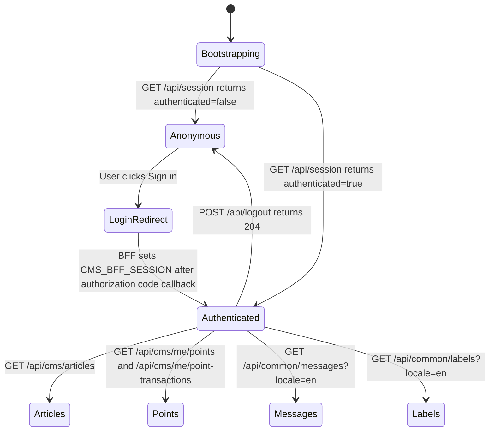

# Authentication Flow

This document records the CMS v1 browser login flow, the APIs used after login, and the core backend mechanisms that keep OAuth2 tokens out of browser storage.

## Ownership Boundaries

| Concern | Owner | Notes |
| --- | --- | --- |
| Login page UI | React SPA | `frontend/src/features/auth/LoginPage.tsx` renders email/password fields and future account-flow links. |
| Credential validation | Authorization service | Spring Security still processes `POST /login`; React never validates credentials as an authority. |
| OAuth2 client session | BFF gateway | The BFF owns the browser session and stores OAuth2 authorized-client state server-side. |
| Resource API access | BFF gateway | The browser calls `/api/**`; the BFF relays access tokens to resource services. |
| JWT validation | Resource services | Resource services validate issuer, signature, expiry, scopes, and role claims. |

## Login And API Flow

```mermaid
sequenceDiagram
    autonumber
    actor User
    participant SPA as React SPA (localhost:5173)
    participant BFF as BFF Gateway (localhost:8080)
    participant Auth as Authorization Service (localhost:9000)
    participant CMS as CMS Resource Service (localhost:8081)
    participant Common as Common Service (localhost:8082)

    User->>SPA: Open /login
    SPA->>Auth: GET /auth/csrf through frontend proxy
    Auth-->>SPA: CSRF form parameter + token
    User->>SPA: Enter email and password
    SPA->>Auth: POST /auth/login through frontend proxy
    Auth-->>SPA: Redirect /oauth2/authorization/cms-bff after form login
    SPA->>BFF: GET /oauth2/authorization/cms-bff
    BFF->>Auth: Redirect /oauth2/authorize
    Auth->>BFF: Redirect /login/oauth2/code/cms-bff?code=...
    BFF->>Auth: POST /oauth2/token
    Auth-->>BFF: access_token + refresh_token
    BFF-->>SPA: Set-Cookie CMS_BFF_SESSION; HttpOnly; SameSite=Lax
    SPA->>BFF: GET /api/session
    BFF-->>SPA: authenticated user summary
    SPA->>BFF: GET /api/me
    BFF-->>SPA: user name + roles
    SPA->>BFF: GET /api/cms/articles
    BFF->>CMS: GET /articles with Authorization: Bearer access_token
    CMS-->>BFF: articles page
    BFF-->>SPA: articles page
    SPA->>BFF: GET /api/cms/me/points
    BFF->>CMS: GET /me/points with Authorization: Bearer access_token
    CMS-->>BFF: point balance
    BFF-->>SPA: point balance
    SPA->>BFF: GET /api/cms/me/point-transactions
    BFF->>CMS: GET /me/point-transactions with Authorization: Bearer access_token
    CMS-->>BFF: point transaction page
    BFF-->>SPA: point transaction page
    SPA->>BFF: GET /api/common/messages?locale=en
    BFF->>Common: GET /messages?locale=en with Authorization: Bearer access_token
    Common-->>BFF: messages page
    BFF-->>SPA: messages page
    SPA->>BFF: GET /api/common/labels?locale=en
    BFF->>Common: GET /labels?locale=en with Authorization: Bearer access_token
    Common-->>BFF: labels page
    BFF-->>SPA: labels page
```

## API Inventory

| Owner | API | Purpose |
| --- | --- | --- |
| SPA -> BFF | `GET /oauth2/authorization/cms-bff` | Start OAuth2 authorization-code login. |
| SPA -> BFF | `GET /api/session` | Bootstrap route protection without reading tokens in JavaScript. |
| SPA -> BFF | `GET /api/me` | Load authenticated user details. |
| SPA -> BFF | `GET /api/csrf` | Load CSRF header/token for unsafe BFF calls. |
| SPA -> BFF | `POST /api/logout` | Invalidate the BFF session. |
| SPA -> Authorization service | `GET /auth/csrf` | Load CSRF form parameter/token for the React-rendered login form. In local dev this is proxied by Vite to `http://localhost:9000/auth/csrf`. |
| SPA -> Authorization service | `POST /auth/login` | Submit username/password through the frontend proxy to Spring Security's `/login` processor. In local dev Vite rewrites `/auth/login` to `http://localhost:9000/login`. |
| SPA -> BFF -> CMS | `GET /api/cms/articles` | List published CMS articles. |
| SPA -> BFF -> CMS | `GET /api/cms/me/points` | Load current member point balance. |
| SPA -> BFF -> CMS | `GET /api/cms/me/point-transactions` | Load current member point transactions. |
| SPA -> BFF -> Common | `GET /api/common/messages?locale=en` | Load message text entries. |
| SPA -> BFF -> Common | `GET /api/common/labels?locale=en` | Load label text entries. |
| Resource services -> Authorization service | `GET /.well-known/jwks.json` | Retrieve public signing keys for JWT validation. |

## React Login Details

The React login page keeps authentication traffic same-origin from the browser's perspective:

```tsx
fetch('/auth/csrf', { credentials: 'include' })

<form action="/auth/login" method="post">
  <input type="hidden" name={csrf.parameterName} value={csrf.token} />
  ...
</form>
```

This avoids CORS and cookie-scope issues that appear when a page served from `http://localhost:5173` posts directly to `http://localhost:9000/login`.

The authorization service exposes two small helpers for the React page:

| Source | Responsibility |
| --- | --- |
| `authorization-service/src/main/java/com/example/cms/authorization/auth/AuthCsrfController.java` | Returns Spring Security's CSRF parameter name, header name, and token. |
| `authorization-service/src/main/java/com/example/cms/authorization/auth/AuthPageController.java` | Redirects authorization-service `GET /login` requests back to the React `/login` page. |

The authorization service still owns the actual form authentication:

```java
.formLogin(login -> login
        .loginPage("/login")
        .loginProcessingUrl("/login")
        .defaultSuccessUrl(postLoginAuthorizationUrl)
        .permitAll())
```

If no saved OAuth2 authorization request exists, a successful form login falls back to `http://localhost:5173/oauth2/authorization/cms-bff`, which starts the BFF authorization-code flow.

## Tested Local Flow

The OAuth2/BFF mechanism was verified on 2026-05-15 at 15:54:11 +08:00 against the local stack:

| Service | URL |
| --- | --- |
| React SPA | `http://localhost:5173` |
| BFF gateway | `http://localhost:8080` |
| Authorization service | `http://localhost:9000` |
| CMS resource service | `http://localhost:8081` |
| Common service | `http://localhost:8082` |

The tested happy path used `admin@example.com` / `password`:

1. `GET /api/session` returned `authenticated=false`.
2. `GET /auth/csrf` returned Spring Security login CSRF metadata with parameter `_csrf`.
3. `POST /auth/login` with valid credentials returned `302` to `http://localhost:5173/oauth2/authorization/cms-bff`.
4. Following the BFF authorization start completed the authorization-code callback and established the BFF session.
5. `GET /api/session` returned `authenticated=true` with user `admin@example.com`.
6. `GET /api/me` returned the BFF user summary with OIDC and scope authorities, including `SCOPE_cms.read`.
7. `GET /api/cms/articles`, `GET /api/cms/me/points`, and `GET /api/common/messages?locale=en` returned `200`, proving the BFF relayed the access token to both resource services.
8. `POST /api/logout` with the BFF CSRF header returned `204`.
9. `GET /api/session` returned `authenticated=false` after logout.

The tested negative path posted `admin@example.com` with an invalid password and returned `302` to `/login?error`.

Use the same browser host throughout the flow. `localhost` and `127.0.0.1` are different cookie hosts; mixing them can make the authorization service login succeed while the BFF session still appears anonymous.

## JWT Validation Flow

```mermaid
flowchart LR
    A["Authorization service loads keystore.pkcs12"] --> B["Builds Nimbus RSAKey with private + public key"]
    B --> C["Spring Authorization Server signs access token"]
    C --> D["BFF stores access/refresh token in server-side session"]
    D --> E["BFF forwards resource request with Bearer token"]
    E --> F["Resource server receives JWT"]
    F --> G["Spring Resource Server reads issuer-uri and jwk-set-uri"]
    G --> H["GET http://localhost:9000/.well-known/jwks.json"]
    H --> I["Validate JWT signature, issuer, expiry, scopes, and role claims"]
    I --> J["Controller receives authenticated Jwt principal"]
```



The browser receives only `CMS_BFF_SESSION`. It does not receive the access token or refresh token, and it does not store JWTs in `localStorage`, `sessionStorage`, or JavaScript-readable cookies.

## Core Snippets

### Authorization Service: Build Signing JWK From PKCS12

Source: `authorization-service/src/main/java/com/example/cms/authorization/config/JwkConfig.java`

```java
@Bean
JWKSet jwkSet(JwtProperties properties) throws Exception {
    KeyStore keyStore = KeyStore.getInstance("PKCS12");
    char[] password = properties.passPhrase().toCharArray();

    try (InputStream inputStream = new ClassPathResource("keystore.pkcs12").getInputStream()) {
        keyStore.load(inputStream, password);
    }

    Certificate certificate = keyStore.getCertificate(properties.keyAlias());
    RSAPublicKey publicKey = (RSAPublicKey) certificate.getPublicKey();
    RSAPrivateKey privateKey = (RSAPrivateKey) keyStore.getKey(properties.keyAlias(), password);

    RSAKey rsaKey = new RSAKey.Builder(publicKey)
            .privateKey(privateKey)
            .keyID(properties.keyId())
            .build();

    return new JWKSet(rsaKey);
}
```

### Authorization Service: Publish Public JWKS

Source: `authorization-service/src/main/java/com/example/cms/authorization/jwt/JwksController.java`

```java
@GetMapping("/.well-known/jwks.json")
public Map<String, Object> jwks() {
    return jwkSet.toPublicJWKSet().toJSONObject();
}
```

### Authorization Service: Add User Claims To Access Token

Source: `authorization-service/src/main/java/com/example/cms/authorization/jwt/JwtClaimsConfig.java`

```java
context.getClaims()
        .claim(JwtClaim.USER_ID.claimName(), UUID.nameUUIDFromBytes(username.getBytes()).toString())
        .claim(JwtClaim.EMAIL.claimName(), username)
        .claim(JwtClaim.ROLES.claimName(), roles);
```

### BFF: Relay Access Token To Resource Services

Source: `bff-gateway-service/src/main/java/com/example/cms/bff/proxy/GatewayProxyController.java`

```java
@RequestMapping("/api/cms/**")
public ResponseEntity<byte[]> proxyCms(
        HttpServletRequest request,
        @RegisteredOAuth2AuthorizedClient("cms-bff") OAuth2AuthorizedClient authorizedClient) throws Exception {
    return proxy(request, authorizedClient, cmsServiceUrl, "/api/cms");
}

private ResponseEntity<byte[]> proxy(
        HttpServletRequest request,
        OAuth2AuthorizedClient authorizedClient,
        String serviceBaseUrl,
        String bffPrefix) throws Exception {
    HttpHeaders headers = copyHeaders(request);
    headers.setBearerAuth(authorizedClient.getAccessToken().getTokenValue());
    ...
}
```

### Resource Server: Stateless JWT Security

Source: `cms-resource-service/src/main/java/com/example/cms/resource/config/SecurityConfig.java`

```java
@Bean
SecurityFilterChain securityFilterChain(HttpSecurity http) throws Exception {
    return http
            .cors(Customizer.withDefaults())
            .csrf(AbstractHttpConfigurer::disable)
            .sessionManagement(session ->
                    session.sessionCreationPolicy(SessionCreationPolicy.STATELESS))
            .authorizeHttpRequests(auth -> auth
                    .requestMatchers(AUTH_WHITELIST).permitAll()
                    .anyRequest().authenticated())
            .oauth2ResourceServer(oauth2 -> oauth2
                    .jwt(jwt -> jwt.jwtAuthenticationConverter(jwtAuthenticationConverter())))
            .build();
}
```

### Resource Server: JWKS Configuration

Source: `cms-resource-service/src/main/resources/application.yml`

```yaml
spring:
  security:
    oauth2:
      resourceserver:
        jwt:
          issuer-uri: ${JWT_ISSUER:http://localhost:9000}
          jwk-set-uri: ${JWT_JWK_SET_URI:http://localhost:9000/.well-known/jwks.json}
```

### Frontend: Session-Based API Client

Source: `frontend/src/shared/api/http.ts`

```ts
const response = await fetch(path, {
  ...init,
  credentials: 'include',
  headers,
});

if (response.status === 401) {
  window.location.assign('/oauth2/authorization/cms-bff');
  throw new Error('Authentication required');
}
```

## Post-Login Frontend State


