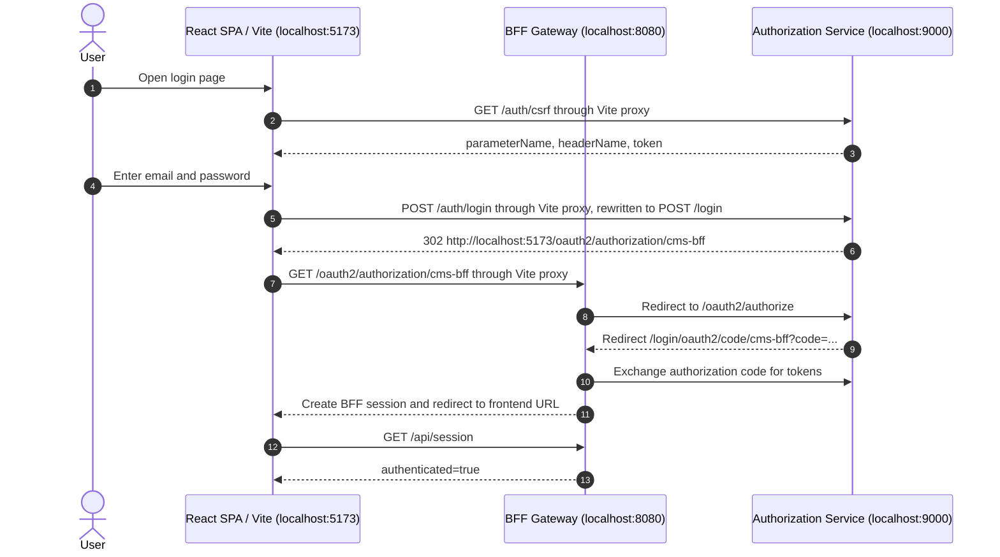

# Login Flow

This document explains the browser login flow that starts in `LoginPage.tsx`, including how the login CSRF token is loaded, why there is no `@PostMapping` for the login submit, and where the browser goes after a successful username/password login.

## Local Service Roles

| Service | Local URL | Responsibility |
| --- | --- | --- |
| React SPA | `http://localhost:5173` | Renders the login page and authenticated UI. |
| BFF gateway | `http://localhost:8080` | Owns the browser session and OAuth2 client login. |
| Authorization service | `http://localhost:9000` | Authenticates username/password and issues OAuth2 tokens. |

The frontend uses the Vite dev server as a same-origin proxy:

| Browser path | Proxied target | Notes |
| --- | --- | --- |
| `/auth/csrf` | `http://localhost:9000/auth/csrf` | Loads the authorization-service login CSRF token. |
| `/auth/login` | `http://localhost:9000/login` | Submits the form to Spring Security's login processor. |
| `/oauth2/**` | `http://localhost:8080/oauth2/**` | Starts or continues the BFF OAuth2 login flow. |
| `/api/**` | `http://localhost:8080/api/**` | Calls BFF APIs after login. |

## Sequence



## Step 1: Login Page Loads CSRF

`frontend/src/features/auth/LoginPage.tsx` runs this when the page mounts:

```tsx
fetch('/auth/csrf', { credentials: 'include' })
```

From the browser's perspective, this sends:

```http
GET http://localhost:5173/auth/csrf
Cookie: JSESSIONID=...
```

There is no request body and no username/password. The `credentials: 'include'` option tells the browser to include existing cookies and to accept cookies from the response. This matters because Spring Security's default CSRF token is associated with the current HTTP session.

Vite proxies the request to:

```http
GET http://localhost:9000/auth/csrf
```

## Step 2: Authorization Service Returns CSRF Metadata

The authorization service allows this endpoint without authentication:

```java
.authorizeHttpRequests(auth -> auth
        .requestMatchers("/auth/csrf").permitAll()
        .anyRequest().authenticated())
```

The controller method accepts a `CsrfToken` argument:

```java
@GetMapping("/auth/csrf")
public Map<String, String> csrf(CsrfToken csrfToken) {
    return Map.of(
            "parameterName", csrfToken.getParameterName(),
            "headerName", csrfToken.getHeaderName(),
            "token", csrfToken.getToken());
}
```

Spring Security creates or loads the request's CSRF token before the controller runs. Spring MVC can then inject that token into the method. A typical response looks like:

```json
{
  "parameterName": "_csrf",
  "headerName": "X-CSRF-TOKEN",
  "token": "generated-token-value"
}
```

The login page stores that response in React state.

## Step 3: Login Form Submits The Hidden Token

The React form posts to `/auth/login`:

```tsx
<form action="/auth/login" method="post">
  {csrf && <input type="hidden" name={csrf.parameterName} value={csrf.token} />}
  ...
</form>
```

So the browser submits form data like:

```http
POST http://localhost:5173/auth/login
Content-Type: application/x-www-form-urlencoded

username=admin@example.com&password=password&_csrf=generated-token-value
```

Vite rewrites only this path:

```ts
rewrite: (path) => (path === '/auth/login' ? '/login' : path)
```

The authorization service receives:

```http
POST http://localhost:9000/login
```

## Step 4: There Is No `@PostMapping("/auth/login")`

There is no controller method for this login submit because Spring Security handles it with its authentication filter chain.

The authorization service configures form login like this:

```java
.formLogin(login -> login
        .loginPage("/login")
        .loginProcessingUrl("/login")
        .defaultSuccessUrl(postLoginAuthorizationUrl)
        .permitAll())
```

The important line is:

```java
.loginProcessingUrl("/login")
```

That registers Spring Security's username/password authentication processing for:

```http
POST /login
```

The request is consumed by Spring Security before it reaches a normal Spring MVC `@PostMapping`. Spring Security validates:

| Input | Purpose |
| --- | --- |
| `username` | User identifier, matching the login form field name. |
| `password` | User password, matching the login form field name. |
| `_csrf` | CSRF form token returned earlier by `/auth/csrf`. |

If authentication fails, Spring Security redirects back to the login page with an error. If authentication succeeds, it redirects to the configured success URL.

## Step 5: Successful Form Login Redirects To BFF OAuth2 Start

The configured fallback success URL is:

```text
http://localhost:5173/oauth2/authorization/cms-bff
```

This URL is on the frontend origin, but it is not handled by `App.tsx`. Vite proxies `/oauth2/**` to the BFF:

```ts
'/oauth2': {
  target: 'http://localhost:8080',
  changeOrigin: true,
}
```

So the browser requests:

```http
GET http://localhost:5173/oauth2/authorization/cms-bff
```

and the BFF receives:

```http
GET http://localhost:8080/oauth2/authorization/cms-bff
```

This path is handled by Spring Security's `oauth2Login()` support in the BFF, not by React routing.

## Step 6: BFF Completes OAuth2 Login

The BFF is configured as an OAuth2 client:

```java
.oauth2Login(oauth2 -> oauth2.defaultSuccessUrl(frontendUrl, true))
.oauth2Client(Customizer.withDefaults())
```

When the BFF receives `/oauth2/authorization/cms-bff`, Spring Security starts the authorization-code flow and redirects the browser to the authorization service's `/oauth2/authorize` endpoint.

Because the user has just logged in to the authorization service, the authorization service can issue an authorization code and redirect back to the BFF callback:

```text
http://localhost:8080/login/oauth2/code/cms-bff?code=...
```

The BFF exchanges that code for tokens server-side, stores the OAuth2 client state in its server-side session, creates the BFF browser session, and then redirects to the frontend URL.

## Step 7: `App.tsx` Finally Sees An Authenticated Session

After the BFF redirects back to the frontend, the React app runs normally.

`App.tsx` calls `useSession()`, which checks the BFF session through `/api/session`. Because the BFF session now exists, the response indicates an authenticated user, and `App.tsx` renders the authenticated shell instead of `LoginPage`.

In short:

```text
LoginPage.tsx
  -> GET /auth/csrf
  -> POST /auth/login
  -> authorization-service Spring Security handles POST /login
  -> redirect to /oauth2/authorization/cms-bff
  -> Vite proxies to BFF
  -> BFF completes OAuth2 authorization-code login
  -> redirect back to frontend
  -> App.tsx checks /api/session
  -> authenticated UI renders
```

## Key Things To Remember

`/auth/csrf` is a helper endpoint for the React-rendered login form. It returns the CSRF parameter name and token that Spring Security expects on the login POST.

`/auth/login` is a frontend/proxy path. The authorization service actually receives `POST /login`.

There is no `@PostMapping` for login because Spring Security's `UsernamePasswordAuthenticationFilter` handles `POST /login`.

`http://localhost:5173/oauth2/authorization/cms-bff` looks like a frontend URL, but Vite proxies it to the BFF. React's `App.tsx` does not render this route.

`App.tsx` becomes relevant again only after the BFF has completed OAuth2 login and redirected back to the normal frontend route.
